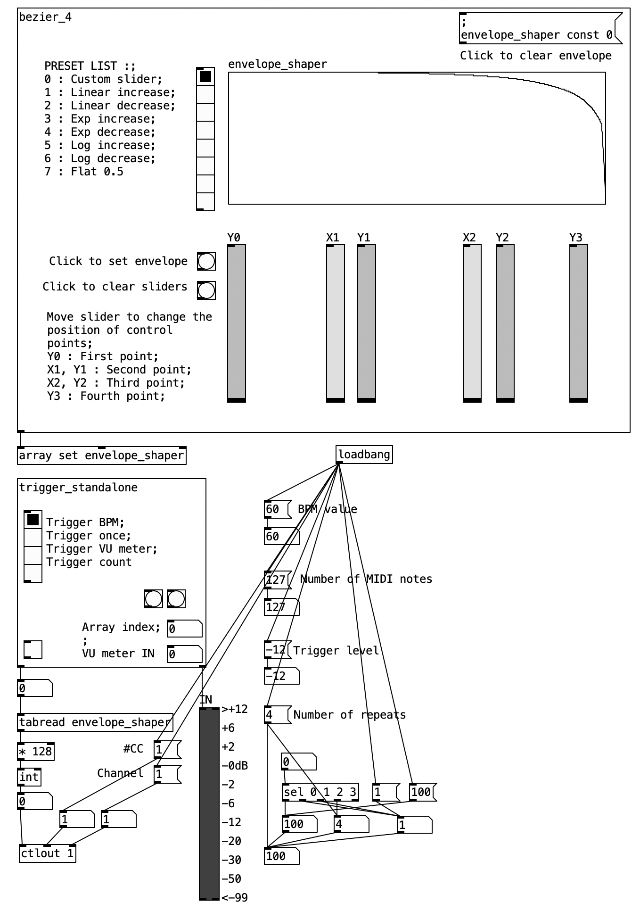

# PewPew
PureData patch to simulate laser effect.

## Requirements
 - [PureData](https://puredata.info)
 - [LoopMIDI](https://www.tobias-erichsen.de/software/loopmidi.html)
 - Any Pitch Bend Plugin that supports MIDI CC control.

Note - Only 32 bit version is supported on Windows OS for the moment.

## Installation
### 1. Pure Data :
1. Download the folder and make sure system requirements (32-bit for Windows and 64 bit for MacOS) are met.  
2. Run PewPew.pd  
3. Set #CC and channel numbers as required.  
4. Set a looper like LoopMIDI for windows and IACdriver for Macos under MIDI Output device in Pure Data.  

### 2. DAW :
1. Configure your DAW and plugin to read the MIDI looper data.  
2. Set #CC and channel numbers from 1.3 in the plugin.   

## Features

### PRESET LIST : 
Shape of the envelope that the MIDI follows. Custom shape can be modleled using sliders Y0, X1, Y1, X2, Y2, Y3.
### BPM value :
Rate of MIDI note change
### Number of MIDI notes :
Max number of MIDI note to output. (Y axis of envelope_shaper).
### Trigger level :
Level in dB the input signal beyong which to trigger envelope.
### Trigger standalone :
+ Trigger BPM - envelope repeats every set BPM value
+ Trigger once - Envelope runs once.
+ Trigger VU meter - envelope runs when input audio signal exceeds Trigger level value
+ Trigger count - Total number of times to run the envelope

_Patch in action with Neural DSP Archetype Gojira X and Cubase_

### Source code
The patch was developed as an external for Pure Data using C. Feel free to send an email for access to source code. 